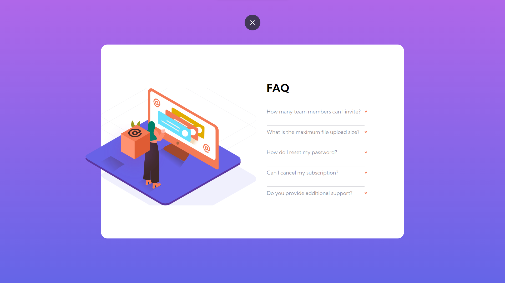
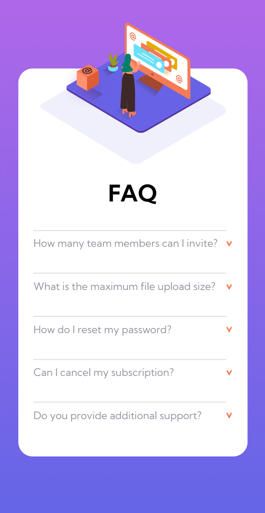

# FAQ-Accordion-Card

# Frontend Mentor - FAQ accordion card solution

This is a solution to the [FAQ accordion card challenge on Frontend Mentor](https://www.frontendmentor.io/challenges/faq-accordion-card-XlyjD0Oam). Frontend Mentor challenges help you improve your coding skills by building realistic projects. 

## Table of contents

- [Overview](#overview)
  - [The challenge](#the-challenge)
  - [Screenshot](#screenshot)
  - [Links](#links)
- [My process](#my-process)
  - [Built with](#built-with)
  - [Continued development](#continued-development)
  - [Useful resources](#useful-resources)
- [Author](#author)

## Overview

### The challenge

Users should be able to:

- View the optimal layout for the component depending on their device's screen size
- See hover states for all interactive elements on the page
- Hide/Show the answer to a question when the question is clicked

### Screenshot

### Links

- Solution URL: [https://github.com/AmanGupta1703/FAQ-Accordion-Card]
- Live Site URL: [https://github.com/AmanGupta1703/FAQ-Accordion-Card/]

## My process

### Built with

- Semantic HTML5 markup
- CSS custom properties
- Flexbox

### Continued development

1) Position
2) FlexBox 
3) Responsive Design

### Useful resources

- [W3School => FlexBox](https://www.w3schools.com/css/css3_flexbox_items.asp)
- [W3School => Position](https://www.w3schools.com/cssref/pr_class_position.asp)
## Author

- Website - [FAQ Accordian Card](https://github.com/AmanGupta1703/FAQ-Accordion-Card/)
- Frontend Mentor - [@AmanGupta1703](https://www.frontendmentor.io/profile/AmanGupta1703)
